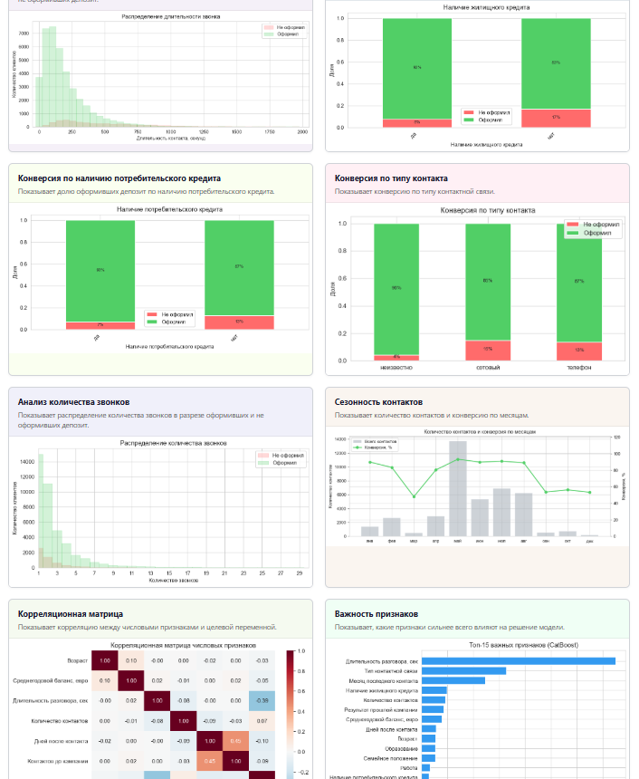
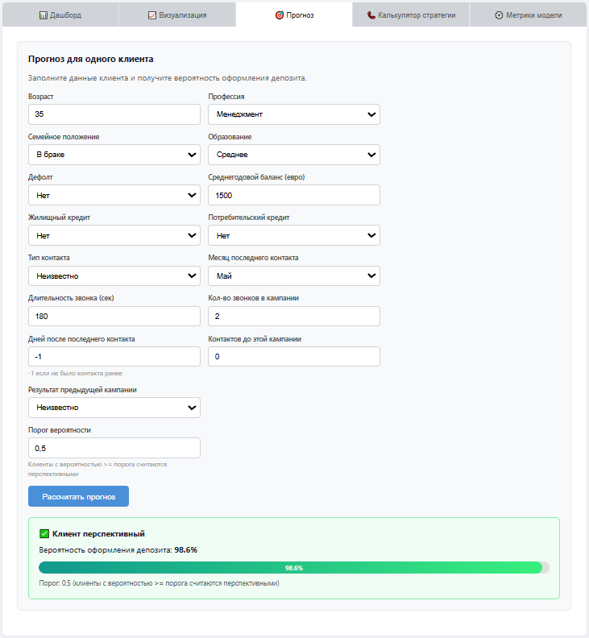
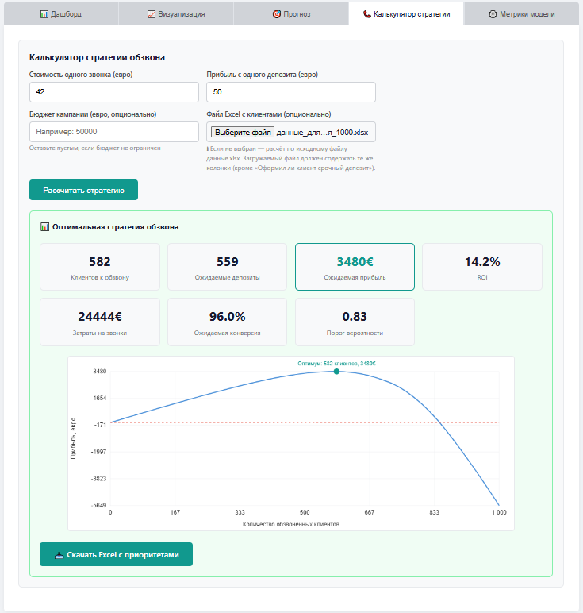

# Прогнозирование оформления депозита (Bank Marketing)

ML-приложение для приоритизации клиентов телемаркетинга. CatBoost-модель предсказывает вероятность оформления срочного депозита, дашборд с графиками и калькулятор оптимальной стратегии обзвона.

## Превью



## Технологии

Python 3.9+, FastAPI, CatBoost, Pandas, Matplotlib/Seaborn, scikit-learn, Jinja2, Uvicorn.

## Быстрый старт

```bash
pip install -r requirements.txt
python train_model.py     # обучить модель и сгенерировать графики
python run_app.py         # запустить сервер
```

Открыть http://127.0.0.1:8000

## Вкладки

| Вкладка | Описание |
|---|---|
| **Дашборд** | Общая статистика: количество клиентов, конверсия |
| **Визуализация** | 15+ графиков: распределения, конверсия по категориям, важность признаков |
| **Прогноз** | Предсказание для одного клиента по всем 15 признакам |
| **Калькулятор стратегии** | Расчёт оптимального порога вероятности для обзвона с учётом стоимости звонка и прибыли |
| **Метрики модели** | F1, ROC-кривая |

## Формат данных

Excel-файлы с русскими заголовками колонок: `Возраст`, `Работа`, `Семейное положение`, `Образование`, `Дефолт`, `Среднегодовой баланс, в евро`, `Наличие жилищного кредита`, `Наличие потребительского кредита`, `Тип контактной связи`, `Последний контакт, месяц`, `Длительность контакта, секунд`, `Количество контактов в кампании`, `Дней после последнего контакта`, `Контактов до этой кампании`, `Результат прошлой кампании`.

Целевая колонка (только для обучения): `Оформил ли клиент срочный депозит` (`да`/`нет`).

## Деплой

- **Локально**: `python run_app.py`
